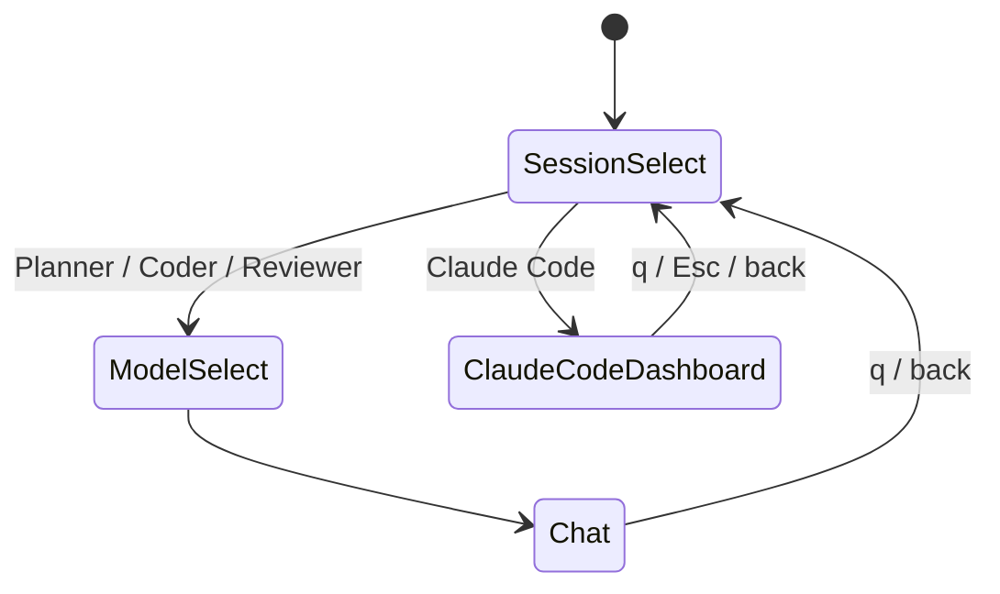
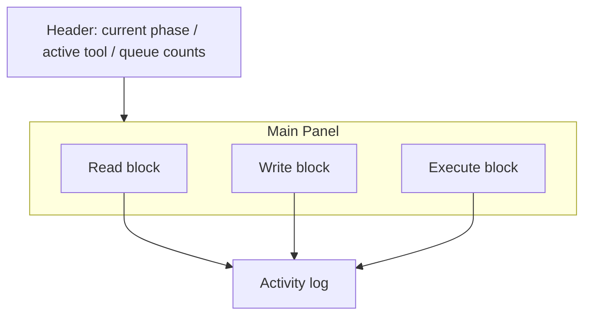
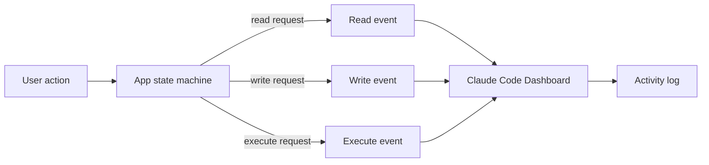

# new-input-form Claude Code Mode Design

**Goal:** Add a new `Claude Code` entry to the `examples/apps/new-input-form` session menu. Selecting it should open a dedicated dashboard that presents real workspace-bound file read, file write, and command execution state in a segmented layout inspired by Claude Code.

**Scope:** This design only covers the `new-input-form` example. It does not change the project-wide terminal runtime or other examples. The new mode must stay within the current workspace root for file access and reuse the existing shell execution path for command runs.

**Non-goals:**
- Do not redesign the existing `Planner / Coder / Reviewer` flow.
- Do not introduce arbitrary system-wide file access.
- Do not add a new general-purpose automation framework.
- Do not replace the current chat mode UI for the existing sessions.

## User Flow

1. The app starts on the existing session menu.
2. `Claude Code` appears as the last item in the session list.
3. Selecting `Claude Code` jumps directly to the new dashboard.
4. The dashboard shows live `read`, `write`, and `execute` tool blocks.
5. `q` or `Esc` returns to the session menu.

## Dashboard Layout

The new mode uses a segmented tool panel rather than a transcript-first chat view.

### Header

The header must expose:
- current mode phase
- active tool name
- queued / running / failed counts

### Read block

The read block must show:
- target path
- status: `idle`, `queued`, `running`, `done`, `error`
- last result preview or error message
- optional elapsed time

### Write block

The write block must show:
- target path
- status
- last write result or error
- optional changed-bytes or diff summary if available

### Execute block

The execute block must show:
- command text
- status
- stdout summary
- stderr summary
- exit code or launch error

### Activity log

The activity log must preserve the latest tool events in order. It is the audit trail for all three tool blocks and should show:
- tool name
- short status line
- result summary
- error details when present

## Real Tool Binding

The dashboard is not a mock. It consumes actual tool activity from the app state:
- `read` is limited to paths inside the current workspace root
- `write` is limited to paths inside the current workspace root
- `execute` uses the existing shell execution path already used by the example

The UI does not own the execution logic. It only renders the current tool state that the app produces.

## Interaction Rules

- `Tab` cycles focus across the three tool blocks.
- `Enter` triggers the focused action when the block supports one.
- `Esc` closes the dashboard and returns to the menu.
- `q` exits the dashboard and returns to the menu.
- While a tool is running, the corresponding block must highlight the active state.
- Errors must remain visible in the block that produced them and in the activity log.

## Error Handling

The dashboard must handle these cases explicitly:
- no tool activity yet
- file not found
- permission denied
- command launch failure
- non-zero exit status
- disconnected or missing execution result

If a tool fails, the relevant block keeps the error text visible until a newer event replaces it.

## Architecture Changes

This design introduces one new app state and one new dashboard rendering path.

Expected structural changes:
- add `ClaudeCodeDashboard` to the app state enum
- add a `Claude Code` item at the end of the session menu
- route selection directly from menu to dashboard
- add a dedicated dashboard render module or focused rendering function
- introduce a unified tool event/state shape that can represent read, write, and execute activity consistently

The existing chat UI remains unchanged for the current session types.

## Testing

The implementation should be covered by tests in three layers:
- menu test: `Claude Code` is the last session item and opens the dashboard
- dashboard test: the three tool blocks render their statuses and summaries
- event mapping test: read/write/execute events refresh the correct block and log entry

## Acceptance Criteria

- `Claude Code` is available as the last item in the session menu.
- Choosing it opens a dedicated segmented dashboard.
- The dashboard shows real workspace-bound read, write, and execute state.
- Tool activity is visible both in the corresponding block and in the activity log.
- Existing session modes continue to work unchanged.

## Self-check

### Placeholder scan
- No `TODO`, `TBD`, or unresolved placeholder text remains.

### Consistency check
- The flow diagram, layout description, and architecture section all describe the same `Claude Code` dashboard.
- Workspace-only access is consistent across the scope, real tool binding, and error handling sections.

### Scope check
- The design stays within one example app and one new dashboard entry.
- It does not require splitting into separate specs.

### Ambiguity check
- “Real tool binding” is defined here as workspace-bound file access and the existing shell execution path.
- The dashboard is display-only with respect to execution control; the app owns the actual tool operations and state updates.
